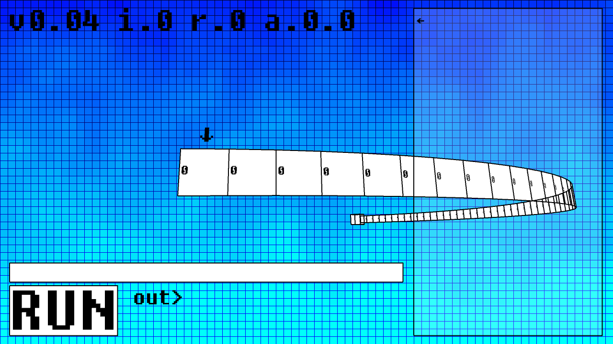

# BrainTruck
BrainF*ck interpreter in Java for final Computational Models Art Project.  
  
Click on this image for a video demonstration.

# Concept
Built for my Final Project in Computational Models- The task was to build a piece of art that can demonstrate some concept of Computational Models. I wanted to create an interpreter for a turingtype language. In this project I wanted to visualize the complex processes of this machine in all of its complexity- this includes the infinite tape length of a turing machine and the basic reduced set of instructions that a turing machine can handle.

# Interesting Points

There were two things I knew I needed when building this project
- An infinite tape
- An easy to use text editor with a useful-easy to handle-system of entering text that was still original.

I started with the tape. Just a long strip of boxes that are rendered each frame. As the index is moved left and right along the tape, the tape has to fluidly move left and right. In order to visualize the expanse of this tape I had to create a vanish point and I thought a good way to do this was to create a box in which an infinite stream of tape can come from. When rendering, it only renders tape that is onscreen, and when moving, the program checks to see if enough tape exists in the array or if more needs to be created. When more needs to be created, the array is lengthened and more data is tacked on.

Making a text editor was easy, but adding features, such as being able to move left and right proved difficult because of the lack of text-kerning support in this language. I didn't know how hard it would be to put a karat between letters until now. I decided to make it so letters could only be added or removed from the end of a line, but that the user could go up and down lines at any time. This made it easy to debug code typed in but only if the user left enough space.

Implementing the language was easy. The language is well documented on [Wikipedia](https://en.wikipedia.org/wiki/Brainfuck) and only has 8 characters. Most of these (besides the loop brackets and input comma) were easy to implement and only used one line. It was so easy that I decided to add animation scale so you could see the program run each instruction. This created a very unique and unexplainably satisfying effect that puts a great polish on this project.

I'm glad I got to work on this project and there's still a bug or two (loops run anyways if the first check returns false!) but I'm very happy with the result and it easily runs a complex hello world example and has copy paste support.

The coolest part- Comments are anything other than the 8 characters so as long as your comment doesn't include +-<>[],. you can write anything you want and it won't be interpreted!